# 🌟 Antigravity ChatGPT Action: Architecture & Best Practices Guide

> **Bridging OpenAI ChatGPT with Google Antigravity Agentic Execution via BYOK (Bring Your Own Key) Gemini API**

---

## Table of Contents
1. [Executive Summary & Concept](#1-executive-summary--concept)
2. [Security & BYOK (Bring Your Own Key) Architecture](#2-security--byok-architecture)
3. [Execution Engine: Antigravity & Gemini Integration](#3-execution-engine-antigravity--gemini-integration)
4. [ChatGPT Action & OpenAPI 3.1 Design Principles](#4-chatgpt-action--openapi-31-design-principles)
5. [Custom GPT Prompt & Instruction Engineering](#5-custom-gpt-prompt--instruction-engineering)
6. [Timeout & Latency Mitigation Strategies](#6-timeout--latency-mitigation-strategies)
7. [Filesystem Sandboxing & Path Traversal Protections](#7-filesystem-sandboxing--path-traversal-protections)
8. [Deployment Topologies (Local Tunnel vs. Cloud Sandbox)](#8-deployment-topologies-local-tunnel-vs-cloud-sandbox)
9. [Observability, Error Handling & Quota Protection](#9-observability-error-handling--quota-protection)
10. [Open Source & Community Contribution Guidelines](#10-open-source--community-contribution-guidelines)

---

## 1. Executive Summary & Concept

### The Vision
OpenAI's ChatGPT provides an intuitive conversational interface across desktop, web, and mobile. However, complex software engineering workflows require deep autonomous agent capabilities:
* Multi-file codebase search and semantic navigation
* Exact file edits with syntax tree validation
* Command execution and interactive test execution in sandboxed terminals
* Advanced reasoning powered by Google's state-of-the-art models (**Gemini 3.8 Flash / Pro**)

**Antigravity ChatGPT** bridges this gap. By implementing an OpenAPI 3.1-compliant bridge service, ChatGPT users can invoke Google's **Antigravity (`agy`)** agent engine directly from their ChatGPT conversation using their own **Gemini API Key**.

### Key Architectural Tenets
* **Zero Model Markup (BYOK)**: Users provide their own Google AI Studio Gemini API key. Requests are routed directly to the Gemini API with no intermediate model token charges.
* **Isolated Execution Contexts**: Each execution turn runs in an isolated workspace with strict privilege boundaries.
* **OpenAPI 3.1 Standard**: Full compatibility with OpenAI's Custom GPT Action specification.

---

## 2. Security & BYOK Architecture

### A. Ephemeral In-Memory Key Management
* **Never Write Keys to Disk**: The user's `GEMINI_API_KEY` must never be stored in persistent configuration files, `.env` files on disk, or database records.
* **Subprocess Environment Isolation**: The Gemini API key should be injected strictly into the runtime process environment (`os.environ["GEMINI_API_KEY"]`) of the Antigravity child process and purged immediately upon process termination.
* **Sanitize Logs & Telemetry**: Intercept all stdout, stderr, and exception payloads. Any string matching the Gemini API key pattern (`AIzaSy[A-Za-z0-9_-]{33}`) must be redacted with `[REDACTED_API_KEY]` before logging.

### B. Header Authentication Standard
* ChatGPT Custom Actions support `Authorization: Bearer <TOKEN>` or Custom Header `X-Gemini-API-Key`.
* Recommended standard: Support both. In the GPT Builder:
  ```yaml
  securitySchemes:
    GeminiApiKeyAuth:
      type: apiKey
      in: header
      name: X-Gemini-API-Key
    BearerAuth:
      type: http
      scheme: bearer
  ```
* Allow users to set their key once in the Custom GPT Action settings, or provide it per-turn if using shared installations.

### C. Rate Limiting & Abuse Prevention
* Implement IP-based and token-based rate limiting (e.g., maximum 30 concurrent agent turns per IP).
* Validate key format before invoking heavy agent processes to prevent unauthenticated resource exhaustion.

---

## 3. Execution Engine: Antigravity & Gemini Integration

### A. Model Provider Configuration
Google Antigravity natively supports direct Gemini API connections using `GEMINI_API_KEY`:
```json
{
  "modelProvider": "gemini"
}
```
When running headless executions with `agy`:
```bash
GEMINI_API_KEY="AIzaSy..." agy \
  --model gemini-3.8-flash-high \
  --effort high \
  --output-format json \
  --dangerously-skip-permissions \
  --print "Refactor the database connector in src/db.py"
```

### B. Model Selection Best Practices
Map user tasks to optimal Gemini tiers:
| Task Category | Recommended Model | Reasoning Effort |
| :--- | :--- | :--- |
| Quick bug fixes, single-file edits, code explanations | `gemini-3.8-flash-low` | `low` |
| Feature additions, test writing, API refactoring | `gemini-3.8-flash-medium` | `medium` |
| Deep architectural refactoring, SWE-bench debugging | `gemini-3.8-flash-high` | `high` / `xhigh` |
| Multi-agent planning & complex system architecture | `gemini-3.1-pro-high` | `high` |

### C. Output Sanitization
* Antigravity outputs internal reasoning (thinking tokens) and tool execution logs.
* For ChatGPT, structure the output cleanly:
  1. `summary`: Concise outcome of the agent's work.
  2. `files_changed`: List of modified, created, or deleted files with diffs.
  3. `commands_executed`: Terminal commands run and their exit codes.
  4. `thoughts_summary`: High-level summary of the agent's reasoning trajectory (omitting excessive internal raw deltas to preserve ChatGPT token context).

---

## 4. ChatGPT Action & OpenAPI 3.1 Design Principles

### A. Token-Conscious Payload Design
ChatGPT has strict token limits on both tool calls and responses. Returning 50,000 lines of terminal logs will cause ChatGPT to fail or truncate.
* **Diff Caps**: Cap unified diffs to 500 lines per file; summarize larger modifications.
* **Terminal Output Summarization**: Capture the first 20 lines and last 20 lines if a command produces massive output.

### B. Explicit Semantic Descriptions
OpenAI Custom GPTs rely entirely on OpenAPI parameter and endpoint `description` fields to decide when and how to call tools:
* Use active verbs: `Execute an autonomous coding or refactoring task using Google Antigravity`.
* Specify parameter constraints: `workspace_type: 'git_repo' | 'ephemeral' | 'local'`.
* Mark required fields clearly.

### C. Strict Schema Typing
* Use OpenAPI 3.1 with explicit `type`, `items`, and `enum` definitions.
* Avoid arbitrary `additionalProperties: true` where possible so ChatGPT generates valid JSON schemas.

---

## 5. Custom GPT Prompt & Instruction Engineering

The system prompt of the Custom GPT dictates how seamlessly the agent interacts with the user:
1. **API Key Discovery**: If an action returns `401 Unauthorized` or `MISSING_API_KEY`, the GPT must guide the user on how to grab a key from Google AI Studio (`https://aistudio.google.com/`) and save it in the Action settings.
2. **Intent Formulation**: The GPT should formulate concrete, goal-oriented tasks for Antigravity rather than vague one-liners.
3. **Safety Confirmation**: For high-impact operations (e.g. pushing to Git, executing arbitrary scripts), instruct the GPT to summarize the proposed changes before finalizing.

---

## 6. Timeout & Latency Mitigation Strategies

### The 45-Second Challenge
ChatGPT Custom Actions enforce a **45-second HTTP response timeout**. If an Antigravity agent runs tests or complex refactors exceeding 45 seconds, ChatGPT displays a timeout error.

### Recommended Dual-Mode Solution:
1. **Synchronous Fast-Turn Mode (`sync=true`)**:
   - Used for quick tasks (timeout capped at 35 seconds).
   - If the task finishes within 35s, returns the complete result immediately.
2. **Asynchronous Polling Mode (`async=true` / Auto-fallback)**:
   - For long-running tasks, the endpoint returns `202 Accepted` with a `task_id`.
   - The OpenAPI spec exposes `GET /v1/tasks/{task_id}`, and ChatGPT polls until completion.
   - This guarantees that even multi-minute autonomous builds or test suites complete reliably.

---

## 7. Filesystem Sandboxing & Path Traversal Protections

### A. Workspace Isolation
* Each execution turn operates in a distinct directory: `/tmp/antigravity-sandboxes/{session_id}`.
* For Git-based operations, clone shallowly (`--depth 1`) into the ephemeral directory.

### B. Path Traversal Traps
* Reject any input path containing `../` or resolving outside the designated workspace root using `os.path.realpath()`.
* Enforce permissions: ensure the subprocess runner runs as an unprivileged user without `sudo` privileges.

---

## 8. Deployment Topologies

```mermaid
flowchart TD
    subgraph Option1["Topology A: Local Companion (Recommended for Solo Devs)"]
        ChatA["ChatGPT UI"] -->|HTTPS| Cloudflare["Cloudflare Tunnel / ngrok"]
        Cloudflare -->|Localhost:8000| BridgeLocal["Local Bridge Daemon"]
        BridgeLocal -->|Local agy CLI| LocalRepo["Local Codebase / Terminals"]
    end

    subgraph Option2["Topology B: Cloud Hosted (Multi-tenant SaaS / Team)"]
        ChatB["ChatGPT UI"] -->|HTTPS| CloudRun["Google Cloud Run / Kubernetes"]
        CloudRun --> BridgeCloud["FastAPI Bridge Container"]
        BridgeCloud -->|Ephemeral Clones| Sandboxes["Temp Git Sandboxes"]
    end
```



* **Topology A (Local Dev Companion)**: The bridge runs on the developer's workstation. Antigravity can edit actual files in their current working directory and run their local compiler or test suite.
* **Topology B (Cloud Sandbox)**: The bridge runs in Docker on Cloud Run or a VPS. Users supply a Git repository URL (and optional personal access token), and Antigravity operates on a temporary clone.

---

## 9. Observability, Error Handling & Quota Protection

### A. Gemini Quota & Limit Handling
When Google Gemini returns HTTP 429 or quota exhaustion:
* Antigravity identifies `RESOURCE_EXHAUSTED`.
* The bridge catches this immediately and maps it to a clear JSON error:
  ```json
  {
    "status": "error",
    "code": "GEMINI_QUOTA_EXHAUSTED",
    "message": "Your Gemini API key has exceeded its rate limit or daily quota. Please check your Google AI Studio dashboard."
  }
  ```
* This prevents wasted retries and informs the user directly in ChatGPT.

### B. Health & Validation Endpoint
Expose `GET /v1/health` and `POST /v1/auth/verify` to enable the Custom GPT or end-user to test whether their Gemini API key has active access before running tasks.

---

## 10. Open Source & Community Contribution Guidelines

* **Code Style**: Python 3.10+, Type hints (`typing`), Ruff / Black formatting.
* **Testing**: Comprehensive pytest test suite with mock `agy` execution and valid OpenAPI schema validation.
* **Licensing**: Apache 2.0 or MIT License to encourage broad community adoption and extension.
