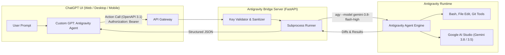

# 🚀 Antigravity for ChatGPT (Gemini BYOK)

[](https://github.com/analyticsrepo01/antigravity-chatgpt/actions)
[](https://opensource.org/licenses/Apache-2.0)
[](https://www.python.org/downloads/)
[](https://spec.openapis.org/oas/v3.1.0)
[](https://deepmind.google/technologies/gemini/)

Bring the autonomous software engineering capabilities of **Google Antigravity (`agy`)** into **OpenAI ChatGPT** using your personal **Google Gemini API Key (Bring Your Own Key - BYOK)**.

---

## 💡 Why This Project?

| Feature | ChatGPT Default | With Antigravity Action |
| :--- | :--- | :--- |
| **Codebase Navigation** | Single snippet pasted | Multi-file semantic search across full repo |
| **File Editing** | Suggested code blocks | Autonomous multi-file syntax edits & unified diffs |
| **Terminal & Tests** | None (or Python sandbox only) | Real bash command execution, `pytest`, git operations |
| **Reasoning Model** | Fixed OpenAI models | **Gemini 3.8 Flash / Pro** with tunable reasoning effort |
| **Model Cost** | Platform subscription | **BYOK** (Free / low-cost direct Google AI Studio API) |

---

## 🏛️ Architecture



---

## 🚀 Quickstart in 3 Steps

### 1. Install & Launch the Bridge
```bash
git clone git@github.com:analyticsrepo01/antigravity-chatgpt.git
cd antigravity-chatgpt

pip install -e .

# Launch local server with automatic Cloudflare/ngrok HTTPS tunnel
python tunnel/launch_tunnel.py
```

### 2. Configure Your Custom GPT in ChatGPT
1. Go to [ChatGPT Custom GPT Builder](https://chatgpt.com/gpts/editor).
2. Set the Name: **Antigravity Agent (Gemini BYOK)**.
3. Paste the system instructions from [`chatgpt/gpt_instructions.md`](./chatgpt/gpt_instructions.md).
4. Under **Actions**, click **Create new action** and paste the content of [`chatgpt/openapi.json`](./chatgpt/openapi.json).
5. Set the server URL to your HTTPS tunnel (e.g., `https://your-tunnel.trycloudflare.com`).

### 3. Add Your Gemini API Key
1. In the Action settings, select **API Key** Authentication.
2. Select **Bearer** (or **Custom Header** `X-Gemini-API-Key`).
3. Paste your key from [Google AI Studio](https://aistudio.google.com/app/apikey).
4. Save and start pairing!

---

## 📚 Documentation & Guides

* **[Architecture & Best Practices Guide](BEST_PRACTICES.md)**: In-depth reference on security, token budgeting, async polling (to prevent ChatGPT 45-second timeouts), and sandboxing.
* **[ChatGPT Setup Walkthrough](chatgpt/setup_guide.md)**: Visual guide to importing the OpenAPI schema and configuring Actions in ChatGPT.
* **[OpenAPI 3.1 Specification](chatgpt/openapi.yaml)**: Complete schema definitions for all endpoints.

---

## 🔒 Security & Privacy (BYOK)

* **Ephemeral Key Lifetime**: Your `GEMINI_API_KEY` is kept in process memory during the turn and never written to disk or logs.
* **Automatic Redaction**: All stdout, stderr, and exception traces pass through an automated regex filter that masks API key patterns (`AIza...`).
* **Path Traversal Guards**: Sandboxed operations strictly prevent directory traversal outside of authorized workspace roots.

---

## 🧪 Running Tests

```bash
pytest -v tests/
```

---

## 📄 License

Licensed under the [Apache 2.0 License](LICENSE).
